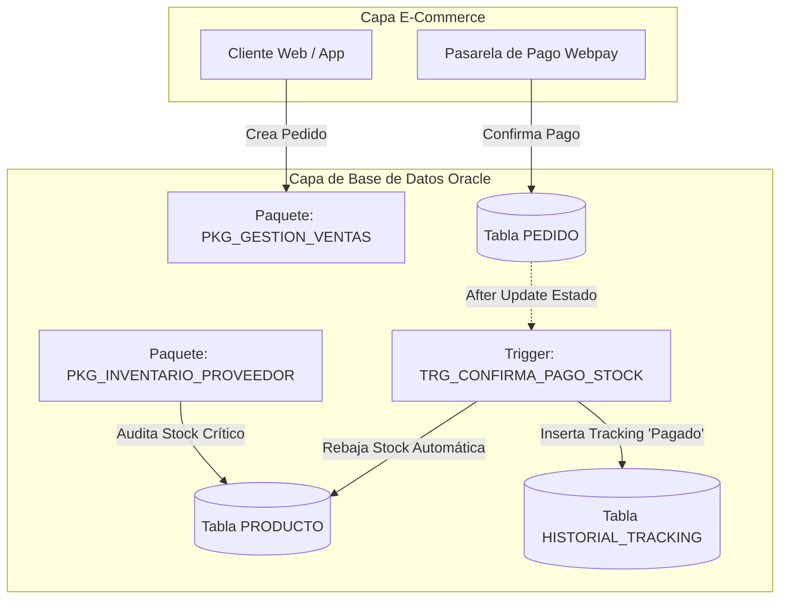
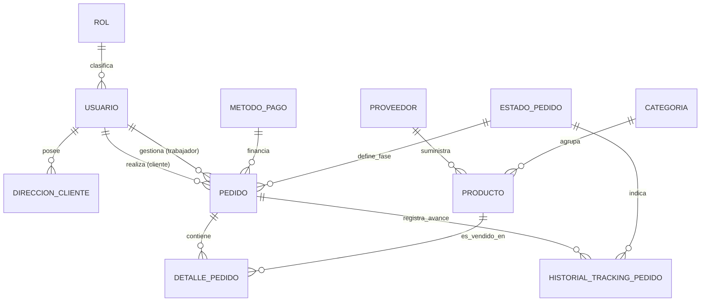

# INFORME TÉCNICO: EVALUACIÓN PARCIAL N° 1
## TALLER DE BASE DE DATOS (BDY1103)
### CASO DE ANÁLISIS SEMESTRAL: "ESTILO URBANO" (E-COMMERCE & DIGITAL FULFILLMENT)

---

**Institución:** Duoc UC  
**Carrera:** Ingeniería en Informática / Analista Programador  
**Sigla Asignatura:** BDY1103 - Taller de Base de Datos  
**Ponderación:** 30% Asignatura (Encargo: 40% | Presentación: 60%)  
**Docente:** Cristian Medina  
**Integrantes:** Eduardo Aránguiz, Luciano Zaninovic, Kevin Urbina  
**Fecha de Entrega:** 16 de septiembre de 2026  
**Semestre / Nivel:** Cuarto Semestre (2026)  

---

## 1. INTRODUCCIÓN

### 1.1 Descripción del Proyecto
El proyecto **"Estilo Urbano"** aborda la transformación digital de una empresa de vestuario y calzado streetwear orientada al público juvenil. Históricamente, la marca operaba de forma informal a través de canales directos en redes sociales (**Instagram Direct** y **WhatsApp Business**). En esta modalidad, los pedidos se acordaban por mensajes dispersos, las transferencias se validaban manualmente y el inventario se gestionaba en planillas desconectadas.

Este modelo rudimentario generó graves problemas operativos: pérdida de clientes por demoras en la atención, ventas reiteradas de prendas agotadas (quiebres de stock), confusión en las direcciones de despacho y una total incapacidad de auditar las relaciones comerciales con los proveedores de confección e importación.

El objetivo del proyecto es diseñar e implementar una arquitectura de base de datos relacional robusta en **Oracle Database** que soporte una **Tienda Online (E-Commerce)** centralizada. En esta primera fase, se utiliza el lenguaje procedural **PL/SQL** para construir bloques anónimos de procesamiento de alto rendimiento capaces de liquidar el desempeño mensual de los operadores digitales, auditar el flujo de pedidos y gestionar excepciones de negocio sin interrumpir la operación transaccional.

### 1.2 Alcance del Proyecto
El alcance de la solución desarrollada en esta etapa cubre:
* **Gestión de Cuentas y Accesos:** Estructuración de perfiles con control de accesos para tres roles fundamentales: `ADMINISTRADOR`, `TRABAJADOR` y `CLIENTE`.
* **Portal de Clientes y Direcciones:** Registro de datos personales, RUT, correo, teléfono y múltiples direcciones de despacho georreferenciadas por comuna y región.
* **Catálogo e Inventario Dinámico:** Control de prendas por categoría, vinculación estricta con proveedores y umbrales de stock mínimo/crítico.
* **Flujo Transaccional de Pedidos y Tracking en Vivo:** Gestión de compras con métodos de pago digitales (**Webpay Plus**, **Mercado Pago**, **Transferencia**) y trazabilidad de los estados de preparación en tiempo real: `PAGADO`, `EN_EMPAQUETAMIENTO`, `EN_CAMINO`, `ENTREGADO` y `CANCELADO`.
* **Cálculo Automatizado de Incentivos en PL/SQL:** Procesamiento masivo de órdenes para evaluar el cumplimiento de metas de los trabajadores y asignación de bonificaciones escalonadas.

Los componentes del negocio impactados positivamente abarcan: **Ventas y Facturación**, **Operaciones y Bodega (Fulfillment)**, **Servicio al Cliente (SLA de Despacho)** y **Contabilidad/Finanzas**.

### 1.3 Tecnologías Utilizadas
* **Motor de Base de Datos:** Oracle Database 19c Enterprise Edition / Oracle 21c XE.
* **Lenguaje Procedural:** PL/SQL (Procedural Language for SQL).
* **Herramienta de Modelado y Desarrollo:** Oracle SQL Developer v23.x / Oracle LiveSQL.
* **Estándar de Seguridad:** Encriptación y almacenamiento seguro de credenciales mediante hashes alfanuméricos.

---

## 2. TIPOS DE DATOS COMPUESTOS (RECORD Y VARRAY)

### 2.1 Integración de RECORD y VARRAY en el Proyecto
Los tipos de datos compuestos en PL/SQL permiten manejar colecciones de elementos y estructuras heterogéneas bajo un mismo identificador dentro de la memoria del proceso (**PGA - Program Global Area**), evitando accesos reiterados a los buffers de datos en disco.

En el proyecto **"Estilo Urbano"**, se integraron de la siguiente manera:

#### A. Tipo RECORD (`r_liquidacion_trabajador`)
Se diseñó un registro definido por el programador para modelar en memoria la ficha de liquidación y desempeño de cada operador:
```sql
TYPE r_liquidacion_trabajador IS RECORD (
    id_trabajador       USUARIO.id_usuario%TYPE,
    rut_trabajador      USUARIO.rut%TYPE,
    nombre_completo     VARCHAR2(100),
    meta_mensual        USUARIO.meta_mensual%TYPE,
    total_pedidos       NUMBER(6) := 0,
    monto_total_ventas  NUMBER(12) := 0,
    pct_cumplimiento    NUMBER(5, 2) := 0,
    tramo_nombre        VARCHAR2(30),
    tasa_bono           NUMBER(4, 2) := 0,
    monto_bonificacion  NUMBER(10) := 0
);
```
**Justificación:** Permite agrupar atributos de tablas disímiles (`USUARIO` y agregaciones de `PEDIDO`) junto con variables calculadas (`pct_cumplimiento`, `monto_bonificacion`) en una única estructura lógica coherente.

#### B. Tipo VARRAY (`t_arreglo_tramos`)
Se implementó un arreglo de tamaño fijo en memoria para parametrizar las tasas de bonificación por cumplimiento:
```sql
TYPE t_arreglo_tramos IS VARRAY(4) OF NUMBER(4, 2);
v_escalas_bono t_arreglo_tramos := t_arreglo_tramos(0.00, 0.03, 0.07, 0.12);
```
* Índice 1 (Cumplimiento < 80%): Bono 0.00 (0%).
* Índice 2 (Cumplimiento entre 80% y 99%): Bono 0.03 (3%).
* Índice 3 (Cumplimiento entre 100% y 119%): Bono 0.07 (7%).
* Índice 4 (Cumplimiento >= 120%): Bono 0.12 (12%).

### 2.2 Mejora de Eficiencia en el Procesamiento
1. **Reducción de Context Switching:** Al procesar las reglas de bonificación mediante un `VARRAY`, no se realizan consultas SQL contra tablas paramétricas auxiliares dentro del bucle de cada trabajador. La búsqueda del multiplicador ocurre directamente en la memoria caché del proceso PL/SQL.
2. **Atomicidad y Claridad de Código:** El uso del `RECORD` garantiza que los datos calculados de un trabajador viajen compactados hacia la instrucción `INSERT INTO RESUMEN_DESEMPENO_MENSUAL`, reduciendo el riesgo de desalinear variables escalares sueltas.
3. **Bajo Consumo de Recursos:** Como el número de tramos de incentivo está estrictamente delimitado por la gerencia comercial (4 tramos), el `VARRAY` es la estructura más eficiente en Oracle, pues reserva un bloque contiguo y liviano de memoria.

---

## 3. DESARROLLO DE BLOQUES PL/SQL CON CURSORES EXPLÍCITOS COMPLEJOS

### 3.1 Fundamentos de Cursores Explícitos y Cuándo Utilizarlos
Un cursor explícito es un área de memoria de trabajo (**Private SQL Area**) nombrada y declarada directamente por el desarrollador para gestionar el conjunto de resultados de una consulta `SELECT` que retorna múltiples filas.

Se deben utilizar cursores explícitos cuando:
* Se necesita procesar fila por fila (**row-by-row**) aplicando reglas de negocio complejas o validaciones condicionales que SQL puro no puede resolver en una sola sentencia.
* Se requiere desacoplar la extracción de datos de la lógica procedimental.
* Se manejan estructuras jerárquicas padre-hijo (ej. un trabajador y sus múltiples ventas).

### 3.2 Diferencia entre Cursores Simples y Complejos
* **Cursor Simple:** Consulta una única tabla o vista sin agregaciones sofisticadas ni parámetros dinámicos (ej. `SELECT * FROM CATEGORIA WHERE estado = 'A'`).
* **Cursor Complejo:** Integra múltiples cláusulas de combinación (**INNER/OUTER JOIN**), filtros multicriterio, funciones de grupo (`SUM`, `COUNT`, `EXTRACT`) y/o recibe **parámetros formales** en tiempo de apertura para filtrar dinámicamente el resultado según el contexto del bucle superior.

### 3.3 Cursores con Parámetros y Bucles Anidados (Loops Anidados)
En el bloque anónimo de "Estilo Urbano", se implementó una arquitectura de **Loops Anidados** soportada por dos cursores:

1. **Cursor Padre (`cur_trabajadores`):**
   Cursor explícito sin parámetros que extrae los operadores de venta y despacho con contrato activo:
   ```sql
   CURSOR cur_trabajadores IS
       SELECT u.id_usuario, u.rut, u.nombre || ' ' || u.apellido AS nombre_completo, u.meta_mensual
       FROM USUARIO u
       WHERE u.id_rol = 2 AND u.estado = 'A'
       ORDER BY u.id_usuario;
   ```
2. **Cursor Hijo Parametrizado (`cur_pedidos_trabajador`):**
   Cursor explícito complejo que recibe como argumentos el identificador del trabajador, el mes y el año de corte:
   ```sql
   CURSOR cur_pedidos_trabajador(p_id_trabajador NUMBER, p_mes NUMBER, p_anio NUMBER) IS
       SELECT p.id_pedido, p.nro_seguimiento, p.fecha_pedido, p.total_pedido,
              mp.nombre_metodo AS metodo_pago, ep.nombre_estado AS estado_actual
       FROM PEDIDO p
       INNER JOIN METODO_PAGO mp  ON p.id_metodo_pago = mp.id_metodo
       INNER JOIN ESTADO_PEDIDO ep ON p.id_estado = ep.id_estado
       WHERE p.id_trabajador = p_id_trabajador
         AND EXTRACT(MONTH FROM p.fecha_pedido) = p_mes
         AND EXTRACT(YEAR FROM p.fecha_pedido)  = p_anio
         AND p.id_estado IN (2, 3, 4, 5)
       ORDER BY p.fecha_pedido;
   ```

**Mecánica de los Bucles Anidados:**
El bucle exterior (`FOR reg_trab IN cur_trabajadores`) itera por cada trabajador. En cada ciclo, se invoca automáticamente el cursor hijo pasando el `id_usuario` actual (`FOR reg_ped IN cur_pedidos_trabajador(reg_trab.id_usuario, 9, 2026)`). Este bucle interno acumula los montos y cuenta las órdenes efectivas antes de calcular el bono.

### 3.4 Ventajas para Grandes Volúmenes de Información
* **Optimización del Buffer:** El paso de parámetros al cursor permite al motor de base de datos utilizar índices específicos (sobre `id_trabajador` y `fecha_pedido`), extrayendo solo el segmento de datos necesario en vez de cargar toda la tabla de órdenes en memoria.
* **Control Fino del Flujo:** Facilita la aplicación de lógica individualizada (ej. resetear contadores por trabajador, atrapar fallas de un único empleado sin afectar la liquidación global).

---

## 4. INTEGRACIÓN DE CONTROL DE EXCEPCIONES

### 4.1 Excepciones Predefinidas de Oracle
Oracle provee más de 20 excepciones estándar asociadas a códigos de error internos comunes. En el proyecto se integró:
* **`ZERO_DIVIDE` (ORA-01476):** Ocurre matemáticamente al intentar dividir por cero. En "Estilo Urbano", esto se gatilla cuando un operador digital fue creado en el sistema con `meta_mensual = 0`. Al ejecutar la fórmula:
  $$\text{pct\_cumplimiento} = \frac{\text{monto\_total\_ventas}}{\text{meta\_mensual}} \times 100$$
  El motor genera el error `ZERO_DIVIDE`. El bloque captura esta excepción, impide que el programa colapse, registra la falla en la tabla de auditoría `LOG_ERRORES_SISTEMA` y asigna el tramo especial `'TRAMO 0 (META NO DEFINIDA)'` para no perder el registro de las ventas logradas por dicho trabajador.

### 4.2 Excepciones Definidas por el Usuario
Corresponden a anomalías funcionales o infracciones de reglas de negocio que para el motor Oracle son operaciones válidas, pero que para la empresa representan una inconsistencia. Se definieron:
* **`ex_sin_pedidos_periodo`:** Disparada mediante `RAISE` cuando un trabajador activo termina el mes con 0 pedidos procesados. Se registra en auditoría con código de control personalizado `-20001`.
* **`ex_meta_invalida`:** Disparada cuando la meta configurada tiene un valor negativo (`meta_mensual < 0`), registrándose con código `-20002`.

### 4.3 Estrategia de Arquitectura: Sub-Bloques Autónomos
Para garantizar la integridad y robustez del proceso masivo, el control de excepciones se ubicó en un **sub-bloque anónimo interno** dentro del bucle de trabajadores:
```sql
FOR reg_trab IN cur_trabajadores LOOP
    BEGIN
        -- Lógica de cálculo y cursores anidados
    EXCEPTION
        WHEN ZERO_DIVIDE THEN ...
        WHEN ex_sin_pedidos_periodo THEN ...
        WHEN OTHERS THEN ...
    END;
END LOOP;
```
**Beneficio crítico:** Si el trabajador $N$ presenta un error (ej. meta cero o sin pedidos), la excepción se consume en su propio sub-bloque, se guarda en el log y el ciclo continúa sin problemas con el trabajador $N+1$. Esto evita que una falla puntual aborte un proceso de liquidación batch que podría involucrar cientos de trabajadores.

---

## 5. EVALUACIÓN DE PROCEDIMIENTOS, FUNCIONES, PAQUETES Y TRIGGERS

Como parte del diseño integral del caso semestral para las siguientes etapas evaluativas, se proyecta la evolución del código desde bloques anónimos hacia **objetos almacenados en la base de datos**.

### 5.1 Definiciones Conceptuales y Propósitos
* **Procedimientos Almacenados (`PROCEDURE`):** Bloques de código con nombre compilados en el diccionario de datos que ejecutan tareas transaccionales, operaciones batch y actualizaciones masivas sin necesidad de retornar un valor obligatorio.
* **Funciones Almacenadas (`FUNCTION`):** Subprogramas especializados diseñados para recibir parámetros de entrada, ejecutar un cálculo o validación y retornar obligatoriamente un valor único mediante la instrucción `RETURN`. Se pueden utilizar tanto en PL/SQL como en consultas SQL puras (`SELECT`, `WHERE`).
* **Paquetes PL/SQL (`PACKAGE`):** Estructuras modulares compuestas por una **Especificación (Header)** y un **Cuerpo (Body)** que permiten agrupar lógicamente procedimientos, funciones, variables globales, cursores y tipos de datos afines, aplicando el principio de encapsulamiento y ocultamiento de información.
* **Disparadores (`TRIGGER`):** Bloques PL/SQL que se ejecutan de manera automática e implícita ante la ocurrencia de eventos DML (`INSERT`, `UPDATE`, `DELETE`) o eventos del sistema en tablas específicas.

---

### 5.2 Estrategia Integral de Implementación para "Estilo Urbano"



#### A. Paquetes Propuestos:
1. **`PKG_GESTION_VENTAS`:**
   * `PROCEDURE prc_registrar_pedido_online(...)`: Recibe los datos del cliente, carro de compra y genera la orden con total neto, IVA y estado `PENDIENTE_PAGO`.
   * `PROCEDURE prc_liquidar_desempeno_mensual(p_mes, p_anio)`: Versión compilada y optimizada del bloque anónimo de esta entrega.
   * `FUNCTION fn_calcular_descuento_cliente(p_id_cliente NUMBER) RETURN NUMBER`: Determina si el cliente posee cupones o beneficios de fidelización.
2. **`PKG_INVENTARIO_PROVEEDOR`:**
   * `FUNCTION fn_verificar_stock_disponible(p_id_prod NUMBER, p_cant NUMBER) RETURN BOOLEAN`: Validación en tiempo real antes de procesar el pago.
   * `PROCEDURE prc_generar_orden_reposicion(p_id_proveedor NUMBER)`: Envía automáticamente una alerta de compra de insumos cuando los productos caen bajo el `stock_minimo`.

#### B. Triggers Propuestos:
1. **`TRG_DESCUENTO_STOCK_PEDIDO` (AFTER UPDATE ON PEDIDO):**
   * Cuando el estado de un pedido cambia a `'PAGADO'`, este disparador recorre las líneas de `DETALLE_PEDIDO` y descuenta automáticamente las unidades de `PRODUCTO.stock_actual`. Si el stock resultante es menor o igual a `stock_minimo`, inserta una notificación en la cola de reposición de proveedores. Esto soluciona de raíz la venta de prendas agotadas que ocurría en WhatsApp e Instagram.
2. **`TRG_AUDITORIA_TRACKING_PEDIDO` (AFTER INSERT OR UPDATE ON PEDIDO):**
   * Cada vez que el campo `id_estado` del pedido se modifica (ej. de `EN_EMPAQUETAMIENTO` a `EN_CAMINO`), el trigger registra una fila en `HISTORIAL_TRACKING_PEDIDO` de forma transparente para que el cliente la consulte en su perfil de la tienda online.

---

### 5.3 Ventajas Técnicas: Reutilización, Mantenimiento y Rendimiento
* **Reutilización y Mantenimiento:** Una función como `fn_calcular_iva` o `fn_verificar_stock` se escribe y prueba una sola vez. Cualquier cambio de regla tributaria o de inventario se modifica únicamente en el paquete correspondiente, sin tocar las aplicaciones front-end ni los procesos periféricos.
* **Reducción de Recompilaciones en Cascada:** Al dividir los paquetes en especificación y cuerpo, se pueden alterar algoritmos internos dentro del `PACKAGE BODY` sin invalidar los objetos dependientes que consumen el `PACKAGE SPECIFICATION`.
* **Rendimiento:** La primera vez que se invoca un subprograma de un paquete, Oracle carga todo el paquete en la memoria compartida (**Shared Pool / SGA**). Las llamadas posteriores de cualquier usuario se resuelven instantáneamente sin lecturas a disco.

---

### 5.4 Riesgos, Limitaciones y Consideraciones de Seguridad
* **Efectos Secundarios Ocultos de Triggers (Mutating Tables):** El abuso de triggers para validaciones complejas puede provocar el temido error `ORA-04091: table is mutating`, además de hacer invisible la lógica de negocio para los desarrolladores. La regla adoptada será reservar los triggers exclusivamente para auditoría y ajustes de stock estrictos.
* **Bloqueos y Concurrencia:** En eventos masivos de venta digital (CyberDays), transacciones concurrentes actualizando las mismas filas de stock pueden provocar *deadlocks* si no se utiliza ordenamiento canónico en los updates.
* **Seguridad (Definer's Rights vs Invoker's Rights):** Por defecto, los procedimientos se ejecutan con privilegios del creador (`AUTHID DEFINER`). Se debe garantizar que las aplicaciones web solo posean permisos de `EXECUTE` sobre los paquetes de ventas, sin acceso directo a las tablas subyacentes (`DROP`, `ALTER`, `DELETE`).

---

## 6. CONCLUSIÓN Y RECOMENDACIONES

### 6.1 Resumen de Resultados
El desarrollo de esta primera entrega evaluativa demostró la efectividad de PL/SQL para resolver la problemática real de **"Estilo Urbano"**. Se transitó con éxito desde una operación informal e ineficiente basada en redes sociales hacia una arquitectura relacional sólida con capacidades de cómputo en base de datos. Se implementó un bloque anónimo capaz de procesar ventas, liquidar cumplimientos de operadores digitales, aplicar escalas de bonos dinámicas y aislar excepciones de negocio y de motor sin abortar la operación.

### 6.2 Impacto en el Negocio
* **Fin del descontrol de stock:** El modelo relacional vincula productos con cantidades finitas, sentando la base para la reserva y descuento en tiempo real.
* **Transparencia hacia el cliente:** Estructura de tracking en vivo (`EN_EMPAQUETAMIENTO`, `EN_CAMINO`, `ENTREGADO`) que elimina las dudas e incertidumbre en la compra digital.
* **Automatización operativa:** El tiempo de cálculo de comisiones se redujo de horas en Excel a fracciones de segundo en Oracle Database.

### 6.3 Recomendaciones de Mejora Futura
1. **Migración a Paquetes en EP2:** Trasladar la lógica del bloque anónimo a un paquete formal `PKG_LIQUIDACIONES` programado mediante **DBMS_SCHEDULER** para su ejecución automática el primer día de cada mes.
2. **Implementación de Bulk Processing (`FORALL` / `BULK COLLECT`):** Si el volumen de pedidos online escala a decenas de miles por día, se recomienda evolucionar los cursores convencionales hacia sentencias `BULK COLLECT` con cláusula `LIMIT` para maximizar el rendimiento de la PGA.
3. **API REST / Oracle ORDS:** Exponer los procedimientos almacenados mediante servicios RESTful utilizando **Oracle REST Data Services** para comunicar directamente la base de datos con la interfaz web y móvil del cliente.

---

## 7. ANEXOS

### 7.1 Diagrama Entidad-Relación Conceptual (Mermaid)


### 7.2 Scripts del Proyecto
1. `01_esquema_estilo_urbano.sql`: Script DDL y DML con la creación de tablas maestras, transaccionales, auditoría y datos de prueba.
2. `02_bloque_anonimo_plsql.sql`: Script ejecutable del bloque anónimo con `RECORD`, `VARRAY`, cursores con parámetros en loops anidados y control de excepciones.
